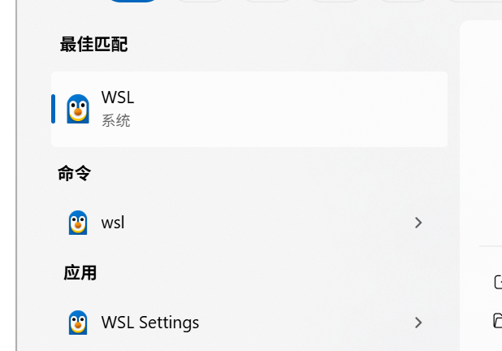

# 🫡 给服务器配置代理

## 1.购置服务器

***

准备一台云服务器，本文将采用Ubuntu系统作为云服务器。

## 2.配置代理

***

#### (1)安装shadowsocks

安装shadowsocks-libev来进行代理


```bash
sudo apt update 
sudo apt upgrade  // 前两步可选，更新一下系统软件包
sudo apt install shadowsocks-libev // 安装shadowsocks
```


#### (2)解析shadowsocks配置文件

启动shadowsocks需要进行配置，参数可以从购买的订阅链接里解析出来，先直接在浏览器里访问订阅链接，可以拿到一个base64的字符串，然后decode处理以后可以得到很多<mark style="color:red;">**`ss://`**</mark> 开头的代理链接：


```
ss://aaaaaaaa@bbb.ccc.dddd:8888/?plugin=simple-obfs%3Bobfs%3Dhttp%3Bobfs-host%3D89911fd7104f.microsoft.com#%F0%9F%87%AD%F0%9F%87%B0%20%E9%A6%99%E6%B8%AF%2001%E4%B8%A81x%20HK
```


这就是一个SS的代理链接，从中我们得到我们需要的配置信息。

首先“_**@”**_&#x4E4B;前&#x7684;_<mark style="color:red;">**aaaaaaaa**</mark>_&#x90E8;分包含密码，需要进行解密。

```javascript
const url = 'aaaaaaaaa' // 需要处理的部分
const decodedBuffer = Buffer.from(url, 'base64').toString('utf-8');

function decrypt(data) {
  var bData = Buffer.from(data, 'base64')
  const iv = bData.slice(0, 12)
  const tag = bData.slice(-16)
  const cdata = bData.slice(12, bData.length - 16)
  const decipher = crypto.createDecipheriv('aes-192-gcm', keyStr, iv)
  decipher.setAuthTag(tag)
  var msg = decipher.update(cdata)
  const fin = decipher.final()
  const decryptedStr = new TextDecoder('utf8').decode(Buffer.concat([msg, fin]))
  return decryptedStr
}
```

通过上面的代码可以得到结&#x679C;_**aes-128-gcm:xxxxxxxx**_，冒号之前的部分是加密方式，后面的是密码，然后根据链接上其他的信息，可以得出如何配置文件。

```json
{
  "server": "aaa.bbb.ccc", // ss链接里的服务域名
  "server_port": 12024, // ss链接里的服务端口
  "local_port": 1080, // 自己服务器启动shadowsocks代理服务的端口
  "password": "xxxxxxxxx", // 密码
  "timeout": 300, // 超时时间
  "method": "aes-128-gcm", // 加密方式，要写SS链接上的，其他加密方式不一定支持
  "plugin": "obfs-local", // 用到的插件，如果没有还得另外安装
  "plugin_opts": "xxxxxxxxxxx", // 插件的配置，复制链接上的就行，记得decode
}
```

这个配置文件需要放在shadowsocks-libev的安装目录下，一般&#x662F;_**/etc/shadowsocks-libev/config.json。**_


接下来启动ss服务。

首先&#x5728;_**/etc/systemd/system/**_&#x76EE;录下新建一个ss-local.service文件。


```
[Unit]
Description=Shadowsocks Local Service
After=network.target

[Service]
ExecStart=/usr/bin/ss-local -c /etc/shadowsocks-libev/config.json // 这里是你的配置文件的路径
Restart=on-failure
User=root // 这里和下一行用root不用再单独设置权限
Group=root

[Install]
WantedBy=multi-user.target
```


#### (3)启动并检验代理服务

***

启动ss服务

```bash
sudo systemctl start ss-local // 和你的.service文件名要一致
sudo systemctl enable ss-local // 设置开机自动启动
sudo systemctl status ss-local // 查看当前服务状态
```

如果日志如下图所示，说明服务成功启动了

<figure><figcaption></figcaption></figure>

如图只是证明ss服务正常启动了，我们还得测试一下我们的代理是不是真的能访问，输入命令测试一下

```bash
curl -x socks5h://127.0.0.1:1080 http://google.com
```

<figure><figcaption></figcaption></figure>

返回以上内容，说明已经正常通过代理请求。

#### (3)将socks5转为http代理

接下来还需要转为http代理，方便docker或者其他应用去使用。依然是&#x5728;_**/etc/systemd/system/**_&#x76EE;录下新建service文件。这里用到了gost去进行转http，首先还是安装gost，然&#x540E;**`chmod +x gost`**&#x786E;保文件有可执行权限。


```
[Unit]
Description=gost proxy
After=network.target

[Service]
ExecStart=/usr/local/bin/gost //你的gost的路径位置 -L http://:8888 //gost转化后的http代理的访问端口 -F socks5://:1080 //你的ss代理服务运行的端口
Restart=on-failure
User=root

[Install]
WantedBy=multi-user.target
```


配置完以后启动gost.serivce，然后通过curl去验证。

<figure><figcaption></figcaption></figure>

```bash
curl -x http://127.0.0.1:8888 http://google.com
```

<figure><figcaption></figcaption></figure>

如上图所示，说明gost转变ss代理成功了。
